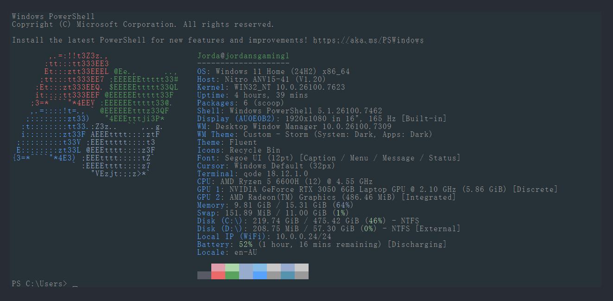
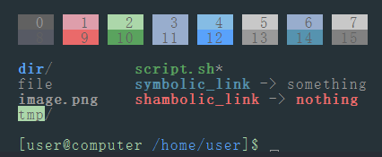
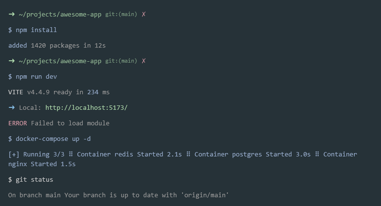

# muted-blackboard
*"easy on the eyes, coherant."* ANSI Brights are vivid, normals are muted. [preview2](#2) is a good example of normals. The fastfetch screenshot is a display of some of the ansi brights.

[muted-blackboard.itermcolors](muted-blackboard.itermcolors)

## Preview:

### 1:

### 2:

